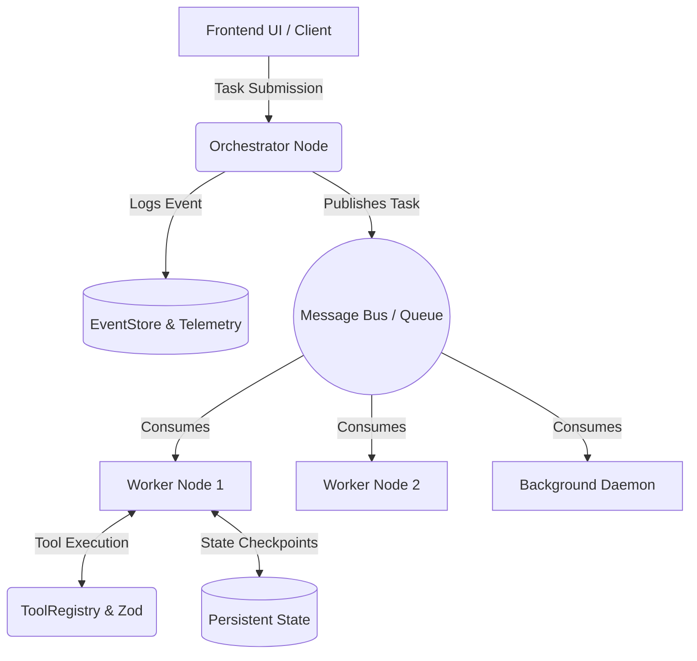

<div align="center">
  
# 🎻 Orchestra: Enterprise Multi-Agent AI Framework

[](https://opensource.org/licenses/MIT)
[](#)
[](#)
[](#)
[](http://makeapullrequest.com)

_An advanced, production-ready TypeScript framework for building, managing, and scaling autonomous AI agent swarms and agentic workflows._

</div>

Welcome to **Orchestra**, the definitive enterprise-grade **Multi-Agent AI Framework**.

Orchestra goes beyond basic chat-bot wrappers by implementing a robust, distributed architecture that features **self-healing worker pools**, **autonomous background daemons**, **state checkpointing**, and **enterprise-grade security governance**. It is engineered from the ground up to orchestrate dozens of intelligent micro-agents to cooperatively execute complex, multi-layered tasks across autonomous swarm environments.

If you are looking to build responsive, robust, and infinitely scalable **Agentic AI systems**, you're in the right place.

---

## 🌟 Why Orchestra? (Key Capabilities)

We designed Orchestra to solve the most prevalent challenges in current open-source multi-agent systems, specifically scaling complexity, error recovery, LLM token explosion, and non-deterministic outcomes.

- **🧠 Advanced Orchestration Trajectories**: Out-of-the-box support for SWARM, HIERARCHICAL, and CONSENSUS-driven agent workflows.
- **🛡️ Enterprise Governance & Sandboxing**: Strict access controls. Agents are governed by tool schemas, specific API execution rate limits, and isolated file-system sandboxes.
- **💾 State Checkpointing & Resume**: Multi-agent workflows can be fragile. Orchestra autosaves state to persistent storage. Pause, debug, and resume workflows seamlessly upon network failures or API rate limits.
- **⚡ Background Autonomous Daemons**: Agents shouldn't block user interfaces. Orchestra dispatches background workers that poll task queues and autonomously execute work asynchronously.
- **📉 LLM Token Optimization**: Through advanced sliding windows and Semantic Caching, Orchestra reduces repetitive token waste across deep multi-agent conversation threads.
- **🔍 Full Observability & Telemetry**: Native OpenTelemetry bridging via an immutable robust EventStore. Monitor agent thought processes, tool calls, and API failures dynamically in real-time.

### 🛠️ Core Technology Stack

- **Backend**: Node.js (TypeScript), OpenTelemetry (Tracing)
- **Frontend Framework**: React 18, Vite
- **Styling**: Tailwind CSS
- **Data Validation**: Zod schemas for robust tool execution

---

## 🧠 How It Works (Architecture Overview)



### 💻 Example: Launching an Agent

```typescript
import { Orchestrator } from "orchestra-framework/orchestration";
import { BaseAgent } from "orchestra-framework/agents";

// 1. Initialize our specialized worker agent
const dataAgent = new BaseAgent({
  name: "DataScraper",
  systemInstruction: "You are an analytics agent. Execute queries carefully.",
  tools: ["SQL_Execute", "WebSearch"],
});

// 2. Swarm Orchestration
const orchestrator = new Orchestrator();
await orchestrator.routeTask({
  agent: dataAgent,
  task: "Compile an aggregated report of recent Q3 user signups.",
  paradigm: "SWARM",
});
```

### 🎯 Example Use Cases

What can you build with Orchestra?

1. **Automated CI/CD Code Reviewers**: Dispatch a swarm of agents when a GitHub PR is opened. A Security Agent checks for vulnerabilities, a Performance Agent profiles the code, and a Manager Agent synthesizes the final PR comment.
2. **Autonomous Data Intelligence Teams**: A background Daemon monitors your sales database. When metrics dip, it spawns an Analyst Agent to execute SQL, graph the output, and email the results to the team.
3. **Continuous UI Quality Assurance**: Ephemeral worker agents spin up to run end-to-end tests against staging branches, simulating distinct user personas dynamically and logging issues independently to your Jira instance.

---

## ⚡ Orchestra vs. The Ecosystem

We love the current open-source agent ecosystems, but Orchestra is specifically built to address the gaps observed when attempting to take agents out of the terminal and into massive enterprise production.

| Feature             | Orchestra 🎻                   | LangChain / LangGraph        | AutoGen / CrewAI       |
| :------------------ | :----------------------------- | :--------------------------- | :--------------------- |
| **Execution Model** | **Asynchronous Worker Pools**  | Synchronous Block / Graph    | Mostly Synchronous     |
| **Error Recovery**  | **Native Checkpoint & Resume** | Custom implementation needed | Basic Retries          |
| **Autonomy**        | **Background Daemons**         | Triggered only               | Primarily interactive  |
| **Token Tracking**  | **Semantic Sliding Windows**   | Manual memory arrays         | Manual / Basic summary |
| **Governance**      | **Hard Tool Execution RBAC**   | Custom implementation needed | Open execution         |

---

## 📚 Comprehensive Documentation

We have meticulously documented every facet of Orchestra into dedicated architectural blueprints. Dive deeply into how the framework operates by exploring our comprehensive **`/readme`** directory:

### Core Systems

- 🧠 [Core Orchestration Engine](readme/core-orchestration.md) - How SWARM and Hierarchical queues operate.
- 👥 [Agent Personas & Hierarchies](readme/agent-personas.md) - Manager, Worker, and Daemon delegation.
- 🛠️ [Skill Management & Custom Tools](readme/custom-tools-and-skills.md) - Building validated Zod tools for your agents.
- 🧠 [Memory Layer (Mesh)](readme/memory-layer.md) - Contextual short-term and semantic long-term memory routing.
- 📉 [LLM Token Optimization](readme/token-optimization.md) - Strategies we use to minimize token explosion.

### Infrastructure & Operations

- ⚙️ [Worker Nodes & Background Daemons](readme/worker-nodes.md) - Scaling asynchronous agent logic.
- 📡 [Internal Message Bus & Pub/Sub](readme/message-bus.md) - Inside the global distributed event queue.
- 💾 [Resilience & Checkpointing Recovery](readme/resilience-recovery.md) - Defend against LLM flakiness.
- 🛡️ [Security & Governance](readme/security-governance.md) - Implementing role-based access for AI functions.
- 📊 [Enterprise Telemetry](readme/enterprise-telemetry.md) - Keeping an audit log of autonomous actions.
- 🚀 [Deployment & Scaling Guide](readme/deployment-and-scaling.md) - Taking Orchestra to production.

---

## 🚀 Installation & Quick Start

Test Orchestra in your own local environment instantly.

> **Security Note:** This repository does NOT store or track any private API keys or personal user details. All sensitive configurations are managed exclusively via your own localized `.env` file.

### Prerequisites

- [Node.js](https://nodejs.org/en/) (v18 or higher recommended)
- Your own [Google Gemini API Key](https://aistudio.google.com/app/apikey) (or other compatible LLM provider key)

### Step-by-Step Setup

**1. Clone the repository**

```bash
git clone https://github.com/your-username/orchestra-multi-agent-framework.git
cd orchestra-multi-agent-framework
```

**2. Install Dependencies**

```bash
npm install
```

**3. Configure Environment Variables**
Copy the example environment template to protect your keys:

```bash
cp .env.example .env
```

Open your newly created `.env` file and insert your API key:

```env
GEMINI_API_KEY="your_api_key_here"
```

**4. Start the Application**
Launch the local Vite React development server alongside the orchestrated backend simulation.

```bash
npm run dev
```

The local web dashboard should now be running on your browser.
You can interact with the collaborative Project Workspace, assign tasks to agents, and watch as the **Autonomous Daemon** dynamically resolves your tasks in the background!

---

## 🏗️ Project Structure

Understanding the repository layout is key to navigating the framework:

- **`src/framework/`**: The core framework implementing the AI orchestration logic.
  - **`agents/`**: Agent classes, distributed personas, and prompt registries.
  - **`core/`**: Message buses and unified Zod-enforced Event Stores.
  - **`orchestration/`**: Worker pools, background daemons, checkpointers, and routing protocols.
  - **`security/`**: Policy enforcers, resource budget tokens, and RBAC sandboxing.
  - **`tools/`**: Tool registries and external API MCP client implementations.
- **`src/components/`**: React UI application to visualize project boards and interactively chat with your live agents.
- **`readme/`**: The detailed, underlying architectural documentation.

---

## 🗺️ Roadmap 2026/2027

We are actively building the future of distributed multi-agent systems. Coming soon:

- [ ] **Native Vector Database Wrappers:** Built-in semantic search for long-term Memory Layers using Pinecone and Weaviate natively.
- [ ] **Multi-Modal Capabilities:** Out-of-the-box support for vision-based agents parsing UI screenshots for automated QA testing.
- [ ] **Kubernetes Operator:** A native Helm chart and Operator to seamlessly deploy `WorkerNodes` dynamically matching Message Bus queue depths.
- [ ] **WebSockets Message Bus:** Real-time event streaming directly to the React dashboard layer for live execution visualization.

---

## 🤝 Contributing

We want Orchestra to become the standard for open-source AI orchestration. Whether you are fixing typos, building new SDK tools, or proposing fundamental architecture shifts, we welcome your input!

Please refer to the open issues and feel free to submit pull requests.

## ⭐ Support the Project

If you find Orchestra valuable or implement it in your architectural workflows, please **Star this repository** and share it with your network! It deeply motivates maintainers and helps the community grow.

---

_Built to bring order to autonomous agent swarms._
