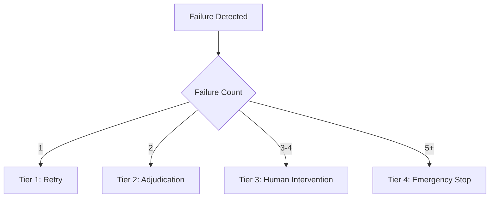
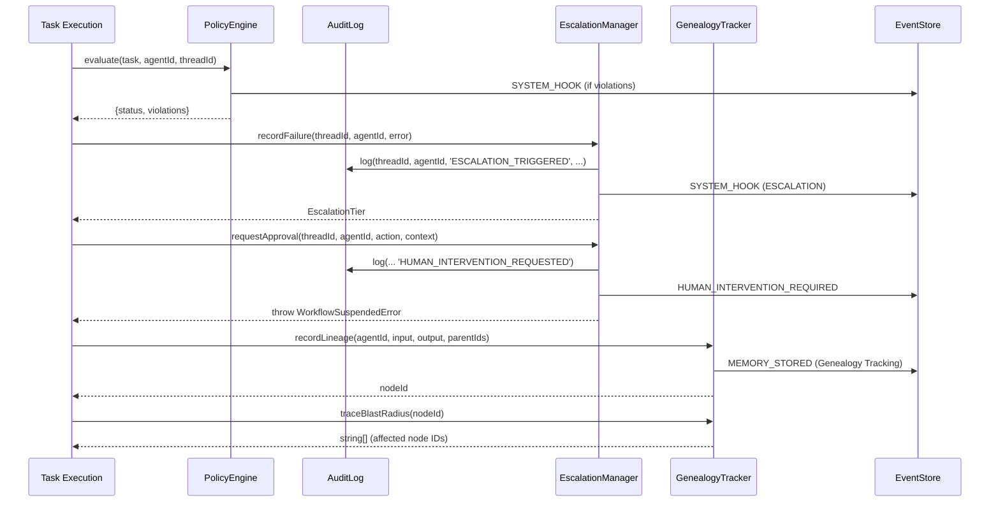

# 🏛️ Orchestra Governance & Compliance

Orchestra ensures that agents operate within safe, ethical, and financial boundaries. The governance layer is an active evaluation engine integrated into the execution lifecycle via Dimension 05 (Policy) and Dimension 04/09 (Provenance).

## 1. Policy Engine

**File:** `governance/PolicyEngine.ts`

The `PolicyEngine` evaluates tasks against registered policies before they reach an LLM or tool. It categorizes violations into three enforcement levels and emits `SYSTEM_HOOK` events via `globalEventStore` for audit.

### Enforcement Levels:
- **BLOCKING**: Returns a **RED** status. Execution is halted immediately.
- **MANDATORY**: Returns a **YELLOW** status. The task proceeds but triggers a `SYSTEM_HOOK` event for audit.
- **ADVISORY**: Returns a **GREEN** status. Logged for review without affecting flow.

### Default Policies:
| Policy ID | Description | Level |
| :--- | :--- | :--- |
| `ANTI_LOOPS` | Prevents infinite re-delegation by checking payload size (>200KB). | BLOCKING |
| `DATA_EXFILTRATION` | Detects attempts to access `process.env`, `.env`, or `ORCHESTRA_ENCRYPTION_KEY`. | MANDATORY |

### API Surface:
- `evaluate(task, agentId, threadId)`: Runs all registered checks and returns `{ status: 'GREEN' | 'YELLOW' | 'RED', violations: string[] }`. Emits `SYSTEM_HOOK` event on violations. **Throws** if a BLOCKING policy is violated.
- `registerPolicy(policy)`: Adds a custom `Policy` object to the engine.

### Policy Interface:
```typescript
interface Policy {
    id: string;
    description: string;
    level: 'ADVISORY' | 'MANDATORY' | 'BLOCKING';
    check: (task: any, agentId: string) => { allowed: boolean; reason?: string };
}
```

## 2. Immutable Audit Trail

**File:** `governance/AuditLog.ts`

The `AuditLog` maintains a cryptographically linked sequence of governance events. Each entry is hashed using SHA-256 and includes the `lastHash` of the preceding entry to ensure tamper-evidence.

- **Mechanism**: Chained SHA-256 Hashing.
- **Storage**: Persisted via `globalStorageMesh` to `.orchestra/audit/log_YYYY-MM-DD.jsonl`.
- **Fallback**: If the mesh doesn't support append, falls back to read-and-rewrite.

### AuditEntry Schema:
```typescript
interface AuditEntry {
    timestamp: number;
    threadId: string;
    agentId: string;
    action: string;
    description: string;
    hash: string; // SHA-256(timestamp|threadId|agentId|action|description|lastHash)
}
```

### API Surface:
- `log(threadId, agentId, action, description)`: Appends a record to the audit trail. Computes hash from `timestamp|threadId|agentId|action|description|lastHash`.

## 3. The 4-Tier Escalation Model

**File:** `governance/EscalationManager.ts`

The `EscalationManager` tracks consecutive failures per `threadId:agentId` pair and manages the transition from autonomous execution to human intervention.



1. **TIER 1 (RETRY)**: Triggered on the first failure.
2. **TIER 2 (ADJUDICATION)**: Triggered on the second failure. A "Critic" or system logic attempts to resolve the error.
3. **TIER 3 (HUMAN_INTERVENTION)**: Triggered at 3-4 failures. Execution is suspended via `WorkflowSuspendedError`. A `HUMAN_INTERVENTION_REQUIRED` event is emitted, requiring a manual `resolveApproval` call.
4. **TIER 4 (EMERGENCY_STOP)**: Triggered at 5+ failures. The thread is terminated to prevent resource exhaustion.

### API Surface:
- `recordFailure(threadId, agentId, error)`: Increments failure count and returns the current `EscalationTier`. Emits `SYSTEM_HOOK` event and logs to `AuditLog`.
- `requestApproval(threadId, agentId, actionDescription, context)`: Suspends the workflow by throwing `WorkflowSuspendedError` and emits `HUMAN_INTERVENTION_REQUIRED` event. Returns a promise that resolves when human provides feedback.
- `resolveApproval(approvalId, resolution, feedback)`: Resumes a suspended workflow, clears failure counts, and logs the resolution to the `AuditLog`. Emits `MEMORY_STORED` event with `HUMAN_FEEDBACK` aspect.
- `getPendingApproval(approvalId)`: Retrieves details of a currently suspended workflow.

### Approval Resolution Types:
```typescript
type ApprovalResolution = 'APPROVED' | 'REJECTED' | 'MODIFIED';
```

### EscalationTier Enum:
```typescript
enum EscalationTier {
    TIER_1_RETRY = 'RETRY',
    TIER_2_ADJUDICATION = 'ADJUDICATION',
    TIER_3_HUMAN_INTERVENTION = 'HUMAN_INTERVENTION',
    TIER_4_EMERGENCY_STOP = 'EMERGENCY_STOP'
}
```

## 4. Genealogy & Provenance Tracking

**File:** `governance/GenealogyTracker.ts`

The `GenealogyTracker` maps the causal chain of agent outputs to inputs. This allows the framework to perform "Blast Radius" analysis if an agent produces a hallucination or policy violation.

- **Lineage Recording**: Every action creates a `ProvenanceNode` containing the `sourceInput`, `outputHash`, and `parentIds`.
- **Blast Radius Tracing**: The `traceBlastRadius(nodeId)` method recursively identifies all downstream nodes affected by a specific node's output.
- **Hallucination Isolation**: By tracing the graph, the system can identify which child agents were "poisoned" by a specific upstream failure.
- **Event Emission**: Each lineage record emits a `MEMORY_STORED` event via `globalEventStore` with context `'Genealogy Tracking'`.

### ProvenanceNode Schema:
```typescript
interface ProvenanceNode {
    id: string;
    agentId: string;
    sourceInput: string;
    outputHash: string; // Simple string hash (not cryptographic)
    timestamp: number;
    parentIds: string[];
}
```

### API Surface:
- `recordLineage(agentId, input, output, parentIds)`: Adds a node to the provenance graph and returns a unique `nodeId`.
- `traceBlastRadius(nodeId)`: Returns an array of all downstream affected node IDs using recursive graph traversal with cycle detection.

## 5. Architecture & Interactions



### Key Dependencies:
- **`globalEventStore`** (from `core/EventStore.ts`): Used by all governance components for event emission.
- **`globalStorageMesh`** (from `storage/StorageMesh.ts`): Used by `AuditLog` for persistent storage.
- **`WorkflowSuspendedError`** (from `orchestration/WorkflowSuspendedError.ts`): Used by `EscalationManager` to suspend execution.

### Global Singletons:
- `globalAuditLog` - `AuditLog` instance
- `globalEscalationManager` - `EscalationManager` instance
- `globalGenealogy` - `GenealogyTracker` instance
- `globalPolicyEngine` - `PolicyEngine` instance