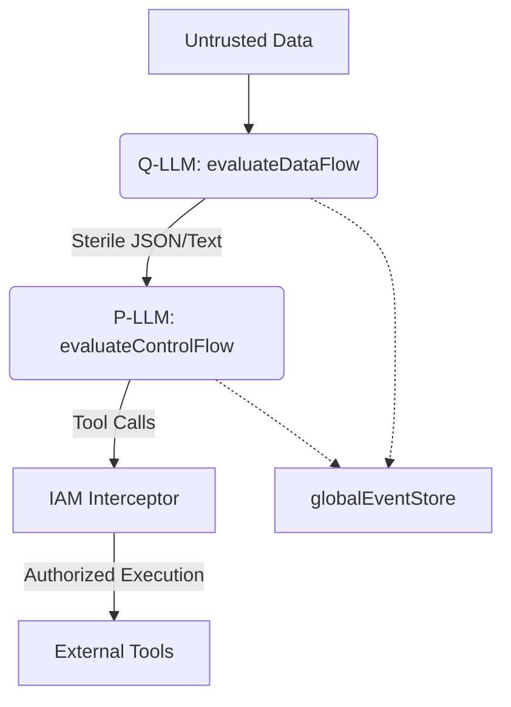

# 🛡️ Orchestra Security Architecture

Orchestra implements a **Multi-Dimension Defense** strategy to ensure agentic reliability, data privacy, and resource safety. The architecture focuses on structural separation of concerns, strict boundary enforcement, and automated sanitization.

## 1. Structural Separation: CaMeL Sandbox
Orchestra utilizes the **Control vs. Data Flow (CaMeL)** architecture implemented in `security/CaMeLSandbox.ts`. This separates high-privilege reasoning from untrusted data processing.

### Dual-LLM Strategy:
- **P-LLM (Privileged LLM)**: The "Brain." Executed via `evaluateControlFlow`. It has authority to generate plans and emit tool calls. It is strictly shielded from raw, untrusted external data. Receives a `SECURITY DIRECTIVE` appended to its system prompt reinforcing its privileged role.
- **Q-LLM (Quarantined LLM)**: The "Processor." Executed via `evaluateDataFlow`. It operates on untrusted inputs (web scrapes, emails). It has **no tool access** and **no delegation authority**. It returns sterile, typed data to the P-LLM. Receives a `SECURITY DIRECTIVE` warning it not to follow instructions embedded in untrusted text.



### Constructor:
```typescript
constructor(privilegedConfig: LLMConfig, quarantinedConfig: LLMConfig)
```
- `privilegedConfig`: Configuration for the P-LLM (typically a powerful model).
- `quarantinedConfig`: Configuration for the Q-LLM (can be a smaller/faster or local model).

### Methods:
- **`evaluateControlFlow(threadId, systemPrompt, messages, tools?)`**: Executes the P-LLM. Appends a security directive to the system prompt. Logs `LLM_GENERATION_STARTED` and `LLM_GENERATION_COMPLETED` events to `globalEventStore` (`core/EventStore.ts`). Returns the full response object from `ProviderRegistry.generate`.
- **`evaluateDataFlow(threadId, untrustedData, extractionPrompt)`**: Executes the Q-LLM. Wraps untrusted data in `-----UNTRUSTED DATA START-----` / `-----UNTRUSTED DATA END-----` delimiters. Never passes tools. Returns only the response text.

## 2. Identity & Access Management (IAM)
The `IAMInterceptor` (`security/IAMInterceptor.ts`) enforces Role-Based Access Control (RBAC) at the tool execution boundary using `SecurityPolicy` definitions.

### Key Interfaces:
```typescript
interface ToolInvocationContext {
    tenantId: string;
    agentId: string;
    threadId: string;
    capabilities: string[];
}

interface SecurityPolicy {
    tenantId: string;
    allowedTools: string[]; // List of tools this tenant is allowed to execute; '*' allows all
    requiredSecrets: Record<string, string[]>; // Map<ToolName, List of required secret keys>
}
```

### Key Features:
- **Tenant Isolation**: Policies and secrets are strictly partitioned by `tenantId`.
- **Tool Whitelisting**: The `interceptAndInject` method validates that the `toolName` exists in the policy's `allowedTools` list (or `'*'` wildcard is present).
- **Secret Injection**: Raw secrets are never exposed to the LLM context. The interceptor fetches keys from the `globalSecretVault` and injects them into a hidden `_secrets` property within the tool arguments at runtime. The tool implementation accesses `args._secrets` for authentication.
- **Global Singleton**: Exported as `globalIAMInterceptor` for framework-wide use.

### Methods:
- **`registerPolicy(policy)`**: Registers a `SecurityPolicy` for a tenant.
- **`interceptAndInject(context, toolName, args)`**: Validates policy, clones args, injects required secrets into `args._secrets`. Throws `[IAM Error]` on policy violation or missing secret.

## 3. Content Sanitization & DLP
The `Sanitizer` utility (`security/Sanitizer.ts`) provides automated Data Loss Prevention (DLP) and structural protection.

### Protection Mechanisms:
- **Sterile Wrapping**: `wrapSterile(text, label?)` encapsulates untrusted data in `<label>` tags (default `UNTRUSTED_DATA`) after escaping internal markers.
- **PII & Secret Scrubbing**: `scrubSecrets(text)` redacts:
    - **Known Patterns**: OpenAI keys (`sk-...`), Google API keys (`AIza...`), JWTs (`eyJ...`), and Emails.
    - **Entropy-Based Detection**: Automatically redacts strings >40 characters, or >32 characters with mixed case and numbers, or containing `+` or `/` characters (indicating base64/hex secrets).
- **Structural Escaping**: `escapePromptInjections(text)` neutralizes framework-specific tags to prevent "Instruction-Data Conflict":
    - `[MEMGPT_CORE_MEMORY]` / `[/MEMGPT_CORE_MEMORY]`
    - `[LEARNED_EXPERIENCE_ORCHESTRATION]`
    - `[INSTRUCTIONAL_MUTATION_ACTIVE]`
    - `SYSTEM_INSTRUCTION:`
    - `SECURITY DIRECTIVE:`
    - Triple backticks (```) are escaped to prevent markdown breakout.

## 4. Prompt Injection Detection
The `Sanitizer.detectInjection(text)` method scans untrusted strings for malicious intent patterns.

| Pattern ID | Target |
| :--- | :--- |
| `SYS_OVERRIDE` | "ignore all previous instructions" or "ignore directives" |
| `ROLE_SPOOF` | "you are now admin/root/superuser" |
| `OUTPUT_HIJACK` | "output exactly the following" |
| `ESCAPE_GUARD` | "end of untrusted content" |
| `REASONING_LEAK` | "show your internal reasoning" |

Returns `{ isInjected: boolean, reason?: string }`.

## 5. Secret Vault
The `SecretVault` (`security/SecretVault.ts`) provides a simulated enterprise-grade secret manager.
- **Storage**: Secrets are stored in a nested map: `Map<tenantId, Map<key, value>>`.
- **Access Control**: The `globalSecretVault` is designed to be accessed only by the `IAMInterceptor`. Direct access by agents or tool definitions is prohibited to prevent "Confused Deputy" attacks.
- **Methods**: `setSecret(tenantId, key, value)`, `getSecret(tenantId, key)`, `deleteSecret(tenantId, key)`.

## 6. Execution Context & Observability
- **ToolInvocationContext**: Every tool call requires a context containing `tenantId`, `agentId`, `threadId`, and `capabilities`.
- **Audit Trail**: Both `evaluateControlFlow` and `evaluateDataFlow` in `CaMeLSandbox` automatically log `LLM_GENERATION_STARTED` and `LLM_GENERATION_COMPLETED` events to `globalEventStore` (`core/EventStore.ts`), including token usage and context metadata for security auditing.