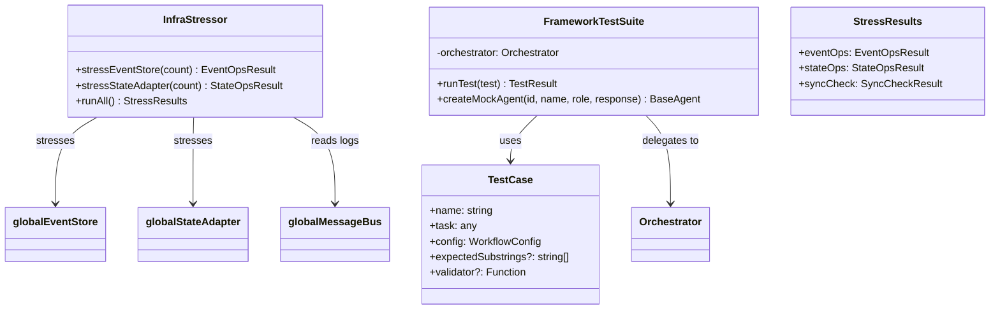
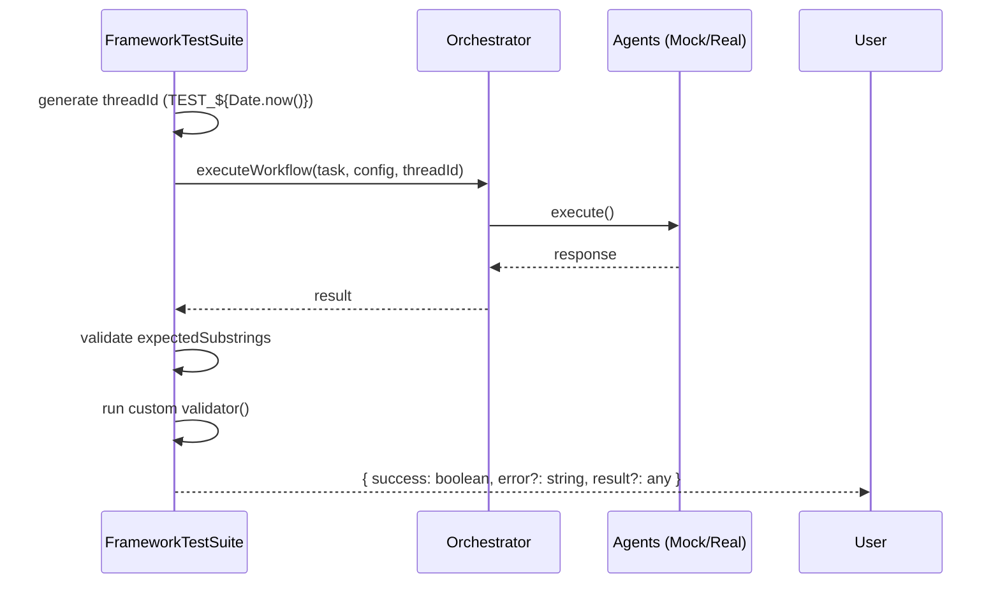

# Testing and Infrastructure Stressing

## Architecture Overview

The testing component consists of three files that provide both functional validation of agent workflows and performance benchmarking of the distributed infrastructure:

- `testing/Stressor.ts` - Infrastructure stress testing (EventStore, StateAdapter, MessageBus)
- `testing/TestSuite.ts` - Functional workflow testing with mock/real agents
- `testing/run_tests.ts` - CI/CD test runner



## Infrastructure Stressing (`testing/Stressor.ts`)

The `InfraStressor` class validates the framework's distributed architecture under high load, targeting the `EventStore`, `StateAdapter`, and `MessageBus` singletons imported from `../core/EventStore.ts`, `../core/StateAdapter.ts`, and `../core/MessageBus.ts`.

### API Surface

| Method | Description |
| :--- | :--- |
| `stressEventStore(count)` | Appends `TELEMETRY_EMIT` events concurrently to the `EventStore`. Returns count, duration (ms), and throughput (ops/sec). |
| `stressStateAdapter(count)` | Performs concurrent Read-Modify-Write (RMW) operations on a shared key (`STRESS_BB`) to detect collision risks and race conditions. |
| `runAll()` | Executes full battery: 2000 EventStore ops + 500 StateAdapter ops. Returns a `StressResults` object with sync verification using `globalEventStore.getLogs()`. |

### Collision Detection Logic

The `stressStateAdapter` method detects race conditions by comparing expected vs actual counter values after concurrent RMW operations:

```typescript
// From testing/Stressor.ts
const current = await globalStateAdapter.get<any>(bbKey) || { counter: 0 };
const nextVal = current.counter + 1;
await new Promise(r => setTimeout(r, Math.random() * 5)); // Simulate work
await globalStateAdapter.set(bbKey, { counter: nextVal });
```

**Collision calculation**: `collisions = count - final.counter`. In a system without locking, `final.counter < count` indicates lost updates due to concurrent access.

### StressResults Interface

```typescript
export interface StressResults {
    eventOps: { countCount: number; durationMs: number; throughput: number };
    stateOps: { count: number; durationMs: number; collisions: number };
    syncCheck: { primaryCount: number; secondaryCount: number; inSync: boolean };
}
```

## Functional Testing (`testing/TestSuite.ts`)

The `FrameworkTestSuite` enables automated validation of agentic workflows using either real or mock agents. It instantiates an `Orchestrator` from `../orchestration/Orchestrator.ts` and delegates workflow execution to it.

### TestCase Interface

```typescript
export interface TestCase {
    name: string;
    task: any;                    // Input for the orchestrator
    config: WorkflowConfig;       // Paradigm, Agents, etc.
    expectedSubstrings?: string[]; // Strings that must exist in serialized result
    validator?: (result: any) => boolean | Promise<boolean>; // Custom validation
}
```

### Mock Agent Creation

Use `FrameworkTestSuite.createMockAgent()` to bypass LLM calls during testing. The method creates an anonymous subclass of `BaseAgent` that returns a fixed response:

```typescript
const mockAgent = FrameworkTestSuite.createMockAgent(
    'mgr', 
    'Manager', 
    'MANAGER', 
    'Hello from Manager'
);
```

The mock agent uses `MemoryMesh` and a dummy LLM config (`{ provider: 'OPENAI', modelName: 'gpt-4o' }`), but its `execute()` method returns the provided string directly.

### Test Execution Flow



### Error Handling

The `runTest` method catches all exceptions and returns them as structured errors:
- **Substring validation failure**: Returns `{ success: false, error: 'Expected result to contain "..."' }`
- **Custom validator failure**: Returns `{ success: false, error: 'Custom validator failed' }`
- **Runtime exceptions**: Returns `{ success: false, error: err.message }`

## Running Tests (`testing/run_tests.ts`)

The test runner executes defined test cases and exits with a non-zero code if any test fails, making it suitable for CI/CD pipelines.

### Default Test Cases

1. **Basic Hierarchical Test**: Validates that a manager agent processes a task and returns expected output using `expectedSubstrings`.
2. **Consensus Adjudication Test**: Validates that multiple worker agents and a judge resolve a task using the `CONSENSUS` paradigm, checking `wasAdjudicated` and `finalAnswer` properties via a custom validator.

### Execution

```bash
# Deno
deno run testing/run_tests.ts

# Node.js (with ts-node)
ts-node testing/run_tests.ts
```

### Exit Codes

- `0`: All tests passed
- `1`: One or more tests failed (or runner crashed)

## Integration Points

- **EventStore**: Stressed via `globalEventStore.append()` with `TELEMETRY_EMIT` events tagged with `threadId: 'STRESS_TEST'`; logs read via `globalEventStore.getLogs()`
- **StateAdapter**: Stressed via `globalStateAdapter.get()`/`set()` on shared key `STRESS_BB`
- **MessageBus**: Accessed indirectly through `globalEventStore.getLogs()` for sync verification
- **Orchestrator**: Used by `FrameworkTestSuite` for workflow execution
- **BaseAgent**: Extended by mock agents for deterministic testing