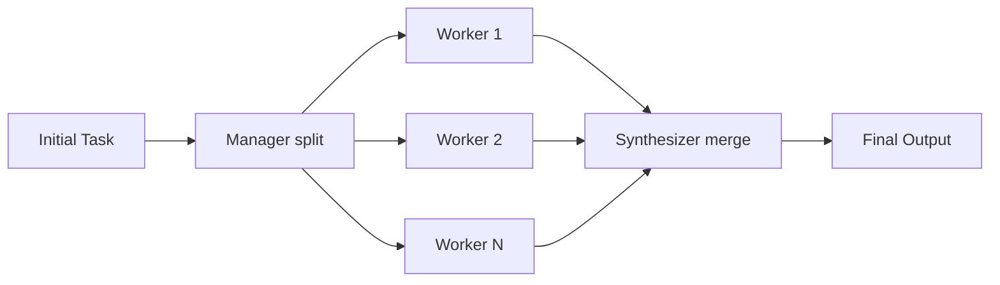

# 🐝 Advanced Swarm & Consensus Paradigms

Orchestra's execution patterns extend far beyond sequential loops. To solve complex generation and reasoning problems, it applies distributed intelligence algorithms inspired by Byzantine Fault Tolerance and MapReduce.

## 1. The SWARM (MapReduce) Pattern

The SWARM paradigm applies horizontal scaling to agent inference. Use this when a task is large, repetitive, and decomposable.

### The Lifecycle:
1. **The 'Mapper' Stage:** A `Manager` agent splits a large objective (e.g., "Analyze these 50 files") into granular sub-tasks.
2. **Distributed Fan-out:** The `Orchestrator` publishes these tasks to the `MessageBus`.
3. **Mass Parallel Execution:** Idle `WorkerNodes` consume the tasks simultaneously across the cluster.
4. **The 'Reducer' Stage:** As results flow back, a `Synthesizer` agent merges the outputs into a single, cohesive final response.

## 2. The CONSENSUS (Debate) Paradigm

For high-stakes decisions (e.g., "Deploy to Production"), a single LLM response is a single point of failure. The CONSENSUS paradigm ensures accuracy through adversarial alignment.

### The Tribunal Process:
1. **Blind Assessment:** The Orchestrator launches 3 distinct agent personas (e.g., `AggressiveDeveloper`, `ConservativeQA`, `NeutralLead`) in parallel. They generate independent reviews in a "logical vacuum" to avoid bias.
2. **The Reveal:** All conclusions are written to the shared **Blackboard**.
3. **Iterative Debate:** Agents are re-prompted to critique their peers' reasoning. "Review User B's argument. Why is it flawed? Revise your stance if necessary."
4. **Convergence:** The loop continues until **Signal Stabilization** (100% agreement) is reached, or a `maxIterations` limit triggers a majority-weighted vote.

## 3. Signal-to-Noise Filtering
To prevent "Hallucination Cascades" in large swarms, Orchestra implements **Entropy Filtering**. If the variance between agent outputs is too high (indicating extreme ambiguity), the system automatically trips the `CircuitBreaker` and escalates to a `HumanHelpEvent`.

