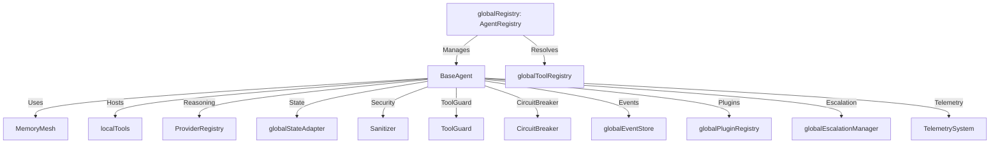
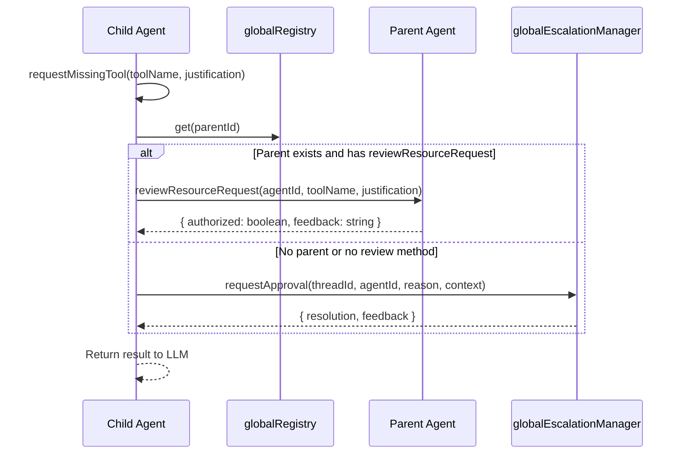

# 🎭 Agent Personas & Behavioral Engineering

In Orchestra, an agent is a **Persona**: a specific configuration of reasoning patterns, tool capabilities, and learned knowledge. This is implemented in `src/framework/agents/BaseAgent.ts` and managed via the `AgentRegistry` at `src/framework/agents/AgentRegistry.ts`.

## Architecture & Discovery

The framework uses a decoupled registry system to manage agent lifecycles and capability resolution. Agents are registered globally via `globalRegistry` and discovered dynamically based on capabilities rather than static dependency injection.

### Role-Based Capability Mapping

The `AgentRegistry` defines default capabilities for specific roles. If an agent is spawned without explicit capabilities, it inherits these defaults. All agents implicitly receive `core_logic` and `discovery` via `getToolsForAgent()`.

| Role | Default Capabilities |
| :--- | :--- |
| `WORKER` | `web_search`, `code_interpreter`, `knowledge_base`, `core_logic`, `data_analysis`, `api_integration` |
| `MANAGER` | `knowledge_base`, `core_logic`, `planning`, `strategic`, `resource_management`, `governance` |
| `CRITIC` | `code_interpreter`, `core_logic`, `validation`, `security_audit`, `quality_assurance` |
| `PLANNER` | `planning`, `core_logic`, `knowledge_base`, `strategic`, `market_analysis`, `forecasting` |

### Agent Lifecycle Events

Every agent spawns a `SYSTEM_HOOK` event via `globalEventStore.append()` with type `AGENT_SPAWNED`. The event includes the full `AgentCard` payload, enabling observability and audit trails.

## The 5-Step Reasoning Loop

Complex tasks leverage the `executeWithReasoning` method in `BaseAgent.ts`, which enforces a structured autonomous logic pattern via the `[AUTONOMOUS_LOGIC_ENABLED]` system prompt:

1. **`<thought>`**: Initial brainstorming and goal deconstruction.
2. **`<plan>`**: Step-by-step sequence of anticipated actions.
3. **`<critic>`**: Self-evaluation for risks, inefficiencies, and logic gaps.
4. **`<action>`**: Final execution or tool calls.
5. **`<verification>`**: Explicit check against the original goal.
   - Returns `GOAL_MET` to finish.
   - Returns `RETRY_NEEDED` to trigger an automatic recursive retry (up to `maxRetries`, default 2).

The loop emits telemetry events via `TelemetrySystem.emit()` for both `REASONING_LOOP_STARTED` and `REASONING_LOOP_COMPLETED`, including token usage and attempt count.

## Memory-Augmented Intelligence

Agents interact with a multi-tiered memory system via built-in tools defined in `BaseAgent.ts`:

### Core Memory
- **`core_memory_append`**: Append information to a Core Memory block (persona or human). Max 2000 chars per call.
- **`core_memory_replace`**: Completely replace the contents of a Core Memory block. Max 5000 chars per call.

### Archival Memory (Semantic Vector Store)
- **`archival_memory_search`**: Query past experiences or facts via vector similarity search. Returns up to `topK` results (default 3).
- **`archival_memory_insert`**: Store new knowledge. Content is scrubbed for secrets via `Sanitizer.scrubSecrets()` before storage.

### Procedural Memory (Wisdom)
The `consultWisdom` method automatically injects relevant `PROCEDURAL` memories and `instructionPatches` into the system prompt. It:
1. Searches for similar memories using `memory.searchSimilarMemories(task, 3)`
2. Filters for `PROCEDURAL` tier memories
3. Appends `[LEARNED_EXPERIENCE_ORCHESTRATION]` block with escaped content via `Sanitizer.escapePromptInjections()`
4. Appends `[INSTRUCTIONAL_MUTATION_ACTIVE]` block with active patches

### Local Blackboard
- **`write_to_local_blackboard`**: Stores temporary, serializable state via `globalStateAdapter`. Keys must match `^[a-zA-Z0-9_]{1,64}$`. Values are scrubbed for secrets and limited to 15000 chars.

## Behavioral Evolution & Security

### Instructional Mutation
Agents are dynamic. The Orchestrator can call `agent.mutate(patch)` to physically evolve an agent's behavior. These patches are:
- Stored in `instructionPatches` array
- Injected into the prompt via `[INSTRUCTIONAL_MUTATION_ACTIVE]` blocks
- Cleared only via an explicit `agent.reset()`

### State Reset
`agent.reset()` clears both `instructionPatches` and `localTools`, emitting a `SYSTEM_HOOK` event with action `AGENT_STATE_RESET`.

### Security Protocols (Dimension 10)

**Sterile Wrapping**: Sensitive context (Core Memory, Wisdom) is wrapped in XML delimiters and sanitized via `Sanitizer.wrapSterile()`.

**Injection Detection**: `Sanitizer.detectInjection()` scans the final user message in `generateResponse()`. If a threat is detected:
- Content is quarantined with `[QUARANTINED_POTENTIAL_INJECTION]` prefix
- A `SYSTEM_HOOK` event is emitted with action `PROMPT_INJECTION_DETECTED`
- Execution continues but with sanitized content

**Tool Guarding**: Every tool execution (local or global) is wrapped in `ToolGuard.wrap()` to enforce RBAC and parameter validation.

**Circuit Breaker**: All LLM calls are wrapped in a `CircuitBreaker` to prevent cascading failures during provider outages.

**Secrets Scrubbing**: `Sanitizer.scrubSecrets()` is applied to all archival memory inserts and blackboard writes.

## Plugin Integration

The `globalPluginRegistry` hooks into the LLM call lifecycle:
- `emitBeforeLLMCall()`: Modifies LLM config and messages before generation
- `emitOnLLMCall()`: Notifies plugins when LLM call starts
- `emitOnLLMResponse()`: Notifies plugins after LLM response with usage data

## API Surface & Key Methods

### `BaseAgent` (`src/framework/agents/BaseAgent.ts`)

| Method | Description |
|--------|-------------|
| `hostTool(name, definition)` | Registers a tool locally to the agent, automatically wrapped with `ToolGuard` |
| `mutate(patch)` | Adds a permanent behavioral adjustment to `instructionPatches` |
| `reset()` | Clears `instructionPatches` and `localTools` |
| `truncateContext(messages)` | Automatically prunes history to fit within `MAX_CONTEXT_CHARS` (32,000 chars / ~8k tokens) |
| `generateResponse(systemInstruction, messages, threadId)` | Core LLM call with security, memory injection, and circuit breaker |
| `generateStructuredResponse(systemInstruction, messages, schema, threadId)` | Structured output generation using `ProviderRegistry.generateObj()` |
| `executeWithReasoning(systemInstruction, messages, threadId, maxRetries)` | 5-step reasoning loop with automatic retry |
| `consultWisdom(task)` | Retrieves procedural memories and active instruction patches |

### Built-in Tools (auto-registered in `generateResponse`)

| Tool | Description |
|------|-------------|
| `core_memory_append` | Append to persona or human core memory block |
| `core_memory_replace` | Replace entire core memory block |
| `archival_memory_search` | Vector search in archival memory |
| `archival_memory_insert` | Store new knowledge (scrubbed) |
| `write_to_local_blackboard` | Store temporary state via `globalStateAdapter` |
| `requestHumanAssistance` | Escalate to human via `globalEscalationManager` |
| `requestMissingTool` | Request new capabilities from Manager or Human |

### `AgentRegistry` (`src/framework/agents/AgentRegistry.ts`)

| Method | Description |
|--------|-------------|
| `register(agent)` | Register an agent by its `card.id` |
| `unregister(agentId)` | Remove agent from registry |
| `get(agentId)` | Get agent by ID |
| `findAgentsByRole(role)` | Find all agents with matching role |
| `findAgentsByCapabilities(requiredCapabilities)` | Dynamic discovery: returns agents whose capabilities include ALL required |
| `getToolsForAgent(agentId)` | Resolves union of `core_logic`, `discovery`, role-based defaults, and specific agent capabilities into functional toolset via `globalToolRegistry` |
| `grantCapability(agentId, capability)` | Runtime privilege escalation with event emission |
| `grantTool(agentId, toolName)` | Grants capability `tool:{toolName}` |
| `getAllAgents()` / `getAll()` | Returns all registered agents |
| `clear()` | Removes all agents from registry |

### `requestMissingTool` Flow

### Error Handling

All LLM generation failures are wrapped in `AgentFrameworkError` with:
- Error code: `LLM_PROVIDER_ERROR` (standard) or `LLM_STRUCTURED_ERROR` (structured)
- Context: `agentId`, `threadId`, `timestamp`
- Immediate telemetry emission via `TelemetrySystem.emit()` with category `PERFORMANCE`

`WorkflowSuspendedError` thrown from tool results is re-thrown to the orchestrator for durability handling.

## Concrete Agent Implementations

### `ManagerAgent` (`src/framework/agents/ManagerAgent.ts`)
- Extends `BaseAgent` with delegation and oversight capabilities
- Implements `reviewResourceRequest()` for tool approval workflow
- Manages child agent lifecycle and task distribution

### `WorkerAgent` (`src/framework/agents/WorkerAgent.ts`)
- Extends `BaseAgent` for task execution
- Focused on tool invocation and result generation
- Reports progress and completion to parent Manager

### `CriticAgent` (`src/framework/agents/CriticAgent.ts`)
- Extends `BaseAgent` with validation and quality assurance focus
- Evaluates outputs from Worker agents for correctness and security
- Provides structured feedback for iterative improvement

### `PlannerAgent` (`src/framework/agents/PlannerAgent.ts`)
- Extends `BaseAgent` with strategic decomposition capabilities
- Breaks complex goals into actionable sub-tasks
- Generates execution plans for Manager/Worker coordination

### `QuarantinedDataAgent` (`src/framework/agents/QuarantinedDataAgent.ts`)
- Specialized agent for handling potentially malicious or untrusted data
- Operates with restricted tool access and enhanced security protocols
- Used for sanitization and analysis of quarantined content