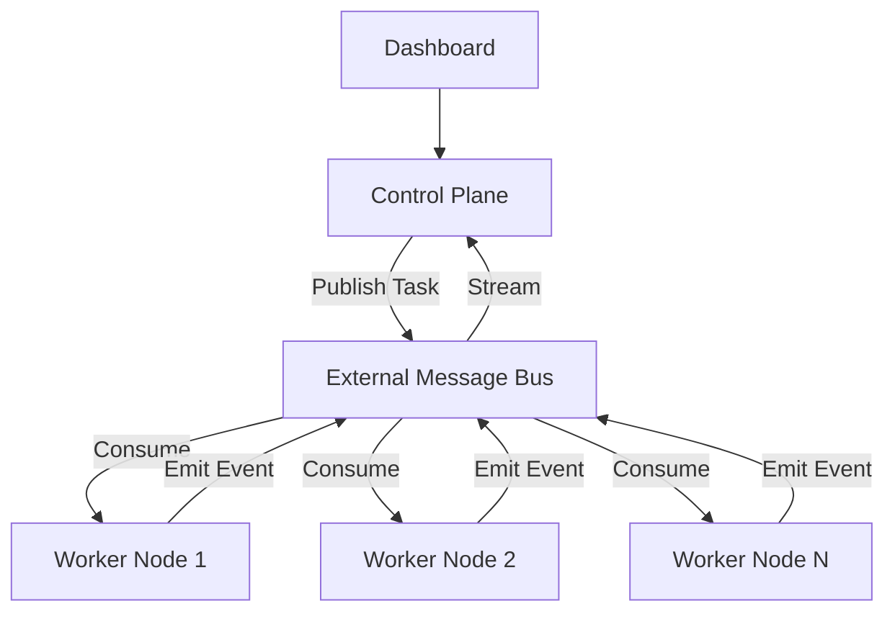

# 🚀 Deployment & Scaling Architecture

Orchestra is designed for **Enterprise Multi-Agent (EMA)** environments. Moving from a local dev server to a globally distributed agent grid requires specific architectural shifts.

## 1. Production Topology

In production, Orchestra should be deployed as a decoupled set of services:

- **Control Plane (API & Orchestrator):** Handles user sessions, UI rendering, and high-level routing. Deployed as a scalable REST/WebSocket service.
- **Worker Plane:** An auto-scaling group of stateless `WorkerNode` containers. These do not serve traffic; they only consume from the `MessageBus`.
- **Event Mesh:** A robust, externalized Message Bus (e.g., Valkey/Redis-compatible Pub/Sub, RabbitMQ, or AWS SQS) used for inter-service communication.

## 2. Persistent State & Storage

The local `.orchestra/` filesystem is not suitable for ephemeral container environments (Cloud Run, Kubernetes).

- **Checkpointing:** Replace the local `Checkpointer` with a cloud-native adapter:
    - **Firestore/Postgres:** For high-integrity workflow state.
    - **Valkey or Redis-compatible backend:** For low-latency task handoffs.
- **Memory Mesh:** Transition from local vector JSON files to an enterprise Vector DB (e.g., Pinecone, Weaviate, or Vertex AI Search).

## 3. Security & Compliance

- **Secret Management:** Never use `.env` files in production. Inject keys (`GEMINI_API_KEY`, `OTLP_ENDPOINT`) via your cloud's Secret Manager (AWS Secrets Manager, GCP Secret Manager).
- **Audit Logging:** Direct the `EventStore` JSONL logs to a centralized log aggregator (ELK Stack, Splunk, or Google Cloud Logging) for immutable compliance tracking.
- **Egress Filtering:** Configure worker pods to communicate through a secure proxy to prevent agents from unintentionally accessing restricted internal networks.

## 4. Horizontal Auto-Scaling (KEDA)

Orchestra workers can be scaled dynamically based on **Queue Depth**:
- Use **KEDA** (Kubernetes Event-driven Autoscaling) to monitor your Valkey/Redis-compatible, RabbitMQ, or SQS queue.
- When 100 research tasks are published, KEDA can instantly scale the `WorkerNode` deployment from 1 to 50 pods.
- Once the queue is depleted, pods are terminated to save compute costs.
