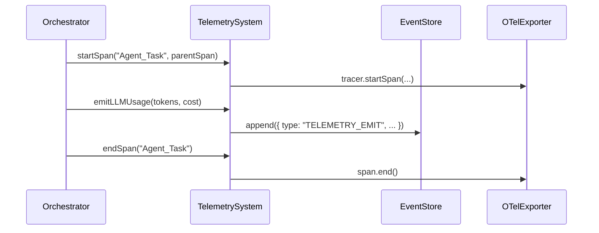

# 📈 Enterprise Telemetry & Observability

Orchestra provides a strictly-typed observability layer designed for high-stakes enterprise environments. Every system call, tool execution, and LLM inference is tracked through the `TelemetrySystem`, which bridges OpenTelemetry (OTel) tracing with a structured internal event store.

## 1. Multi-Layer Tracing (OpenTelemetry)

The framework implements the **OpenTelemetry** standard via `telemetry/OTelExporter.ts`. It supports distributed tracing by exporting spans to any OTLP-compliant collector.

### Configuration
The exporter behavior is controlled via environment variables:
- **Local Mode (Default):** If `OTLP_ENDPOINT` is unset, empty, or set to `'local'`, traces are piped to the `ConsoleSpanExporter`.
- **Export Mode:** Set `OTLP_ENDPOINT` to a valid OTLP URL (e.g., Jaeger, Honeycomb, or AWS ADOT) to enable external collection alongside console output.

### The Trace Hierarchy
The `TelemetrySystem` (found in `telemetry/TelemetrySystem.ts`) manages a nested span architecture:
- **Workflow Span:** The root execution context.
- **Agent/Tool Spans:** Child spans representing specific worker operations or external service calls.

## 2. Structured Global Event Store

In addition to OTel traces, all telemetry is normalized and appended to the `globalEventStore`. This provides a "Black Box Flight Recorder" for auditing agent behavior.

- **File Reference:** `telemetry/TelemetrySystem.ts` -> `emit()`
- **Source Integrity:** Every event is tagged with `sourceAgentId` and `threadId`.
- **Category Routing:** Events are categorized into `LLM_USAGE` and `EXTERNAL_COST` via the `TelemetryPayload` interface.

## 3. Financial Observability (TCO Tracking)

The `TelemetrySystem` provides specialized methods to track the "Total Cost of Ownership" (TCO) for autonomous tasks in real-time.

### `emitLLMUsage`
Records token consumption and estimated USD cost.
- **Inputs:** `sourceAgentId`, `threadId`, `modelId`, `usage` (prompt/completion/total tokens), and `cost`.
- **Category:** `LLM_USAGE`
- **Payload Action:** `LLM_USAGE_RECORDED`

### `emitServiceCost`
Tracks non-LLM expenses such as search APIs, database credits, or specialized tool usage.
- **Inputs:** `sourceAgentId`, `threadId`, `serviceName`, `cost`.
- **Category:** `EXTERNAL_COST`
- **Payload Action:** `SERVICE_COST_RECORDED`

## 4. API Surface

| Method | Description |
| :--- | :--- |
| `startSpan(spanId, parentSpan?)` | Initializes a new OTel span and records the start timestamp. Returns the start time in ms. |
| `endSpan(spanId, error?)` | Closes the span. If an error is provided, sets OTel status to `ERROR` and records the exception. Returns the duration in ms. |
| `getActiveSpan(spanId)` | Retrieves the underlying OpenTelemetry `Span` object for manual attribute tagging. Returns `undefined` if not found. |
| `emit(sourceAgentId, threadId, payload)` | Emits a telemetry event to the `globalEventStore` with type `TELEMETRY_EMIT`. |
| `emitLLMUsage(sourceAgentId, threadId, modelId, usage, cost)` | Helper to log token metrics and costs to the `EventStore`. |
| `emitServiceCost(sourceAgentId, threadId, serviceName, cost)` | Helper to log external API costs to the `EventStore`. |
| `reset()` | Clears all active spans. Used for clean test isolation. |
| `getActiveSpanCount()` | Returns the number of currently active spans. |

## 5. External Integration

Traces and metrics can be exported to industry-standard backends by configuring the `OTLP_ENDPOINT`:
- **Jaeger / Honeycomb:** Via `OTLPTraceExporter`.
- **CloudWatch / Prometheus:** Via OTel Collector sidecars.
- **Audit Logs:** The `globalEventStore` can be streamed to Elasticsearch or S3 for long-term compliance.

## 6. Architecture Details

### OTelExporter (`telemetry/OTelExporter.ts`)
- Singleton instance exported as `globalOTelExporter`.
- Initializes `NodeSDK` with `SimpleSpanProcessor` for each exporter.
- Registers a `SIGTERM` handler to gracefully shut down the SDK.
- Service name defaults to `orchestra-swarm` with version `1.0.0`.
- Tracer is obtained via `trace.getTracer('orchestra-agent-framework')` and exposed through `getTracer()`.

### TelemetrySystem (`telemetry/TelemetrySystem.ts`)
- All methods are static; no instantiation required.
- Maintains an internal `Map<string, { start: number; otelSpan?: Span }>` for active spans.
- OTel span creation is wrapped in a try-catch to silently handle cases where the tracer is not ready.
- The `emit()` method directly appends to `globalEventStore` from `../core/EventStore.ts`.
- Parent span context is passed via `(parentSpan as any).context()` for proper trace propagation.
- Error handling in `endSpan()` sets `SpanStatusCode.ERROR` and records the exception via `recordException()`.