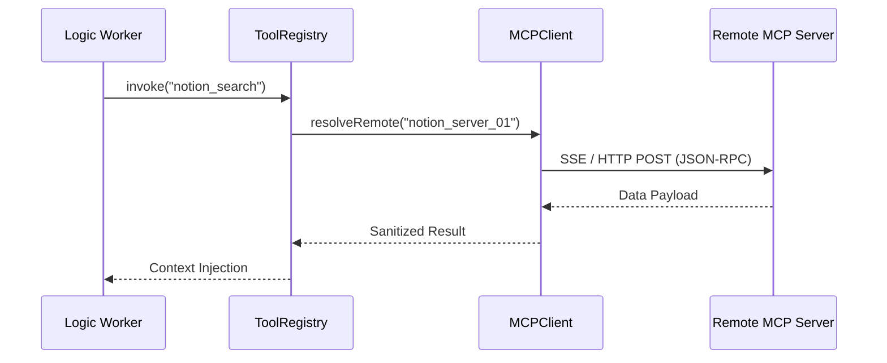

# 🔌 Model Context Protocol (MCP) & Integrations

Orchestra leverages Anthropic's **Model Context Protocol (MCP)** to provide agents with a universal interface for interacting with external SaaS platforms, legacy databases, and specialized enterprise APIs.



## 1. Why MCP?

Traditional tool integration requires hard-coding API logic inside the agentic framework. MCP decouples the "How" from the "What."
- **Zero-Code Scaling:** Add support for Jira, Slack, or GitHub simply by adding an MCP server URL to the `.env` or config.
- **Micro-Sandboxing:** MCP servers can run in isolated Docker containers, completely separate from the Orchestrator cluster.

## 2. Dynamic Tool Discovery

When an agent with MCP capabilities is initialized, the `MCPClient` performs a "Capabilities Handshake."
- **Metadata Hydration:** The server returns a list of supported tools and their **Zod-compatible** schemas.
- **On-the-fly Injection:** These tools are instantly injected into the agent's `SystemInstruction`, allowing it to reason about tools it didn't know existed at the time the framework was built.

## 3. Security & Governance

The `ToolGuard` and `IAMInterceptor` apply to MCP calls just like native tools:
- **Redaction:** Any PII returned by the MCP server is scrubbed before reaching the LLM.
- **Cost Tracking:** The `TelemetrySystem` records the latency and payload size of every remote integration call.
- **Gatekeeping:** High-risk MCP actions (e.g., `delete_account`) still require human approval via the HITL loop.

## 4. Configuring a Connection

```json
{
  "mcpServers": {
    "filesystem": {
      "command": "npx",
      "args": ["-y", "@modelcontextprotocol/server-filesystem", "/path/to/repo"]
    },
    "memory": {
      "url": "https://mcp.orchestra.ai/external-memory"
    }
  }
}
```

