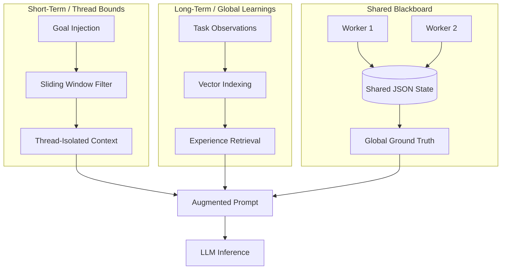

# The Memory Mesh

Large Language Models (LLMs) used within AI frameworks are inherently stateless execution engines. Every single individual API prompt starts completely blank.

The traditional, naive approach to designing multi-agent memory is to simply append every text message sent and received into a massive Array representation, sending the entire continuous log back into the context window for every request. As agent conversations grow deep or involve large context files, this quickly leads to **Token Explosion**, immediate hallucination degradation (as models struggle to find the needle in the haystack), and massive API billing costs.

Orchestra solves this major engineering issue efficiently through an advanced, multi-tiered **Memory Mesh**.

## Short-Term Episodic Memory (Thread Bounds)

Each distinct user objective, task, or agent conversational thread is automatically assigned a unique, isolated UUID (`threadId`). Short-term memory acts as the classic "conversation history", but heavily optimized and sandboxed.

1. **Strict Context Isolation:** A Worker agent assigned to write a specific SQL query has absolutely no business reading the entire 300-message architectural chat history about the frontend UI planning system. It wastes context. By relying on the Thread Bound architecture, the Orchestrator slices out only the critically relevant execution history associated directly with the `threadId` and passes only that sequence to the agent.
2. **Context Sliding Windows:** If a complex code debugging session requires 20 dynamic tool iterations back and forth to hunt down a bug, the conversational payload can easily push past standard model token limits. The internal Memory Mesh dynamically applies a Context Sliding Window architecture. It permanently pins the critical `System Prompt` and the `Initial Core Objective` at the top. It then only feeds the last _N_ tool executions (configurable window sizes) into the pipeline, actively summarizing and aggressively pruning out the middle portion of the conversation where failed tool attempts or conversational drift occurred.

## Long-Term Semantic Memory

In complex multi-agent simulations, agents desperately need to remember their past mistakes and successes entirely _across user sessions_ to naturally evolve and avoid repeatedly making the same errors on new projects.

1. **Embedded Vector Observations (Conceptual):** When a worker agent successfully traverses a complex, originally failing novel task (e.g., fixing a specific obscure build artifact error), the global Orchestrator dispatches a background summarizer agent. This agent reads the execution flow and compresses the winning strategy into a highly dense semantic observation paragraph.
2. **Metadata Tagging:** This extracted summary is pushed to a global vector database (or natively cached in the local `.orchestra/memory/` engine space) and richly tagged with semantic contextual keywords extracted via entity recognition (e.g., `build_error`, `webpack_configuration_plugin`, `solution_path`).
3. **RAG Injection (Retrieval-Augmented Generation):** At the beginning of a fresh task, before a new agent is even spawned, the framework silently performs a fast similarity semantic search against the Long-Term Memory Mesh index. If it surfaces highly relevant past learned experiences, it intelligently injects these insights structurally into the LLM's `SystemInstruction` under an explicit `<experience_database>` XML schema tag.

Example LLM injection output from the system:

> `<experience> You previously tried using the "rm -rf" command on Windows directories, which immediately failed due to native pathing formats. You successfully learned to use the cross-env module or PowerShell specific commands to bypass it. Ensure you do not repeat the failure this time. </experience>`

## Shared 'Blackboard' Memory Arrays

When an Orchestrator is executing in a high-density SWARM paradigm, 10 or more distinct agents might be actively working entirely in parallel. Because they are sandboxed, they cannot natively chat with one another without flooding message channels. The Memory Mesh provides natively a collaborative "Blackboard."

- Concurrent workers can execute an explicit `write_blackboard` tool instruction. This publishes their vital findings or discovered schemas into a live key-value mapping that all other parallel executing agents can immediately query.
- The shared blackboard functions perfectly as a centralized, immutable JSON object state that is continually passed down directly during the state checkpointing sequences. This naturally ensures that all concurrent agents possess an exact, natively synchronized source of the ultimate project ground truth without needing to directly message or interrupt one another across process boundaries.
