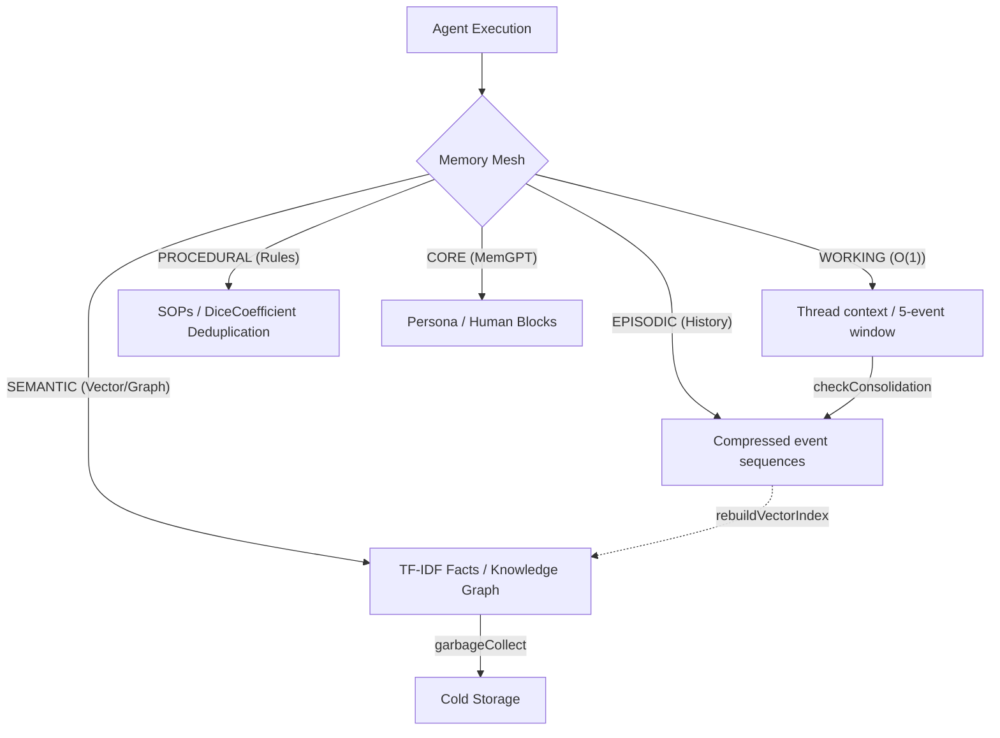
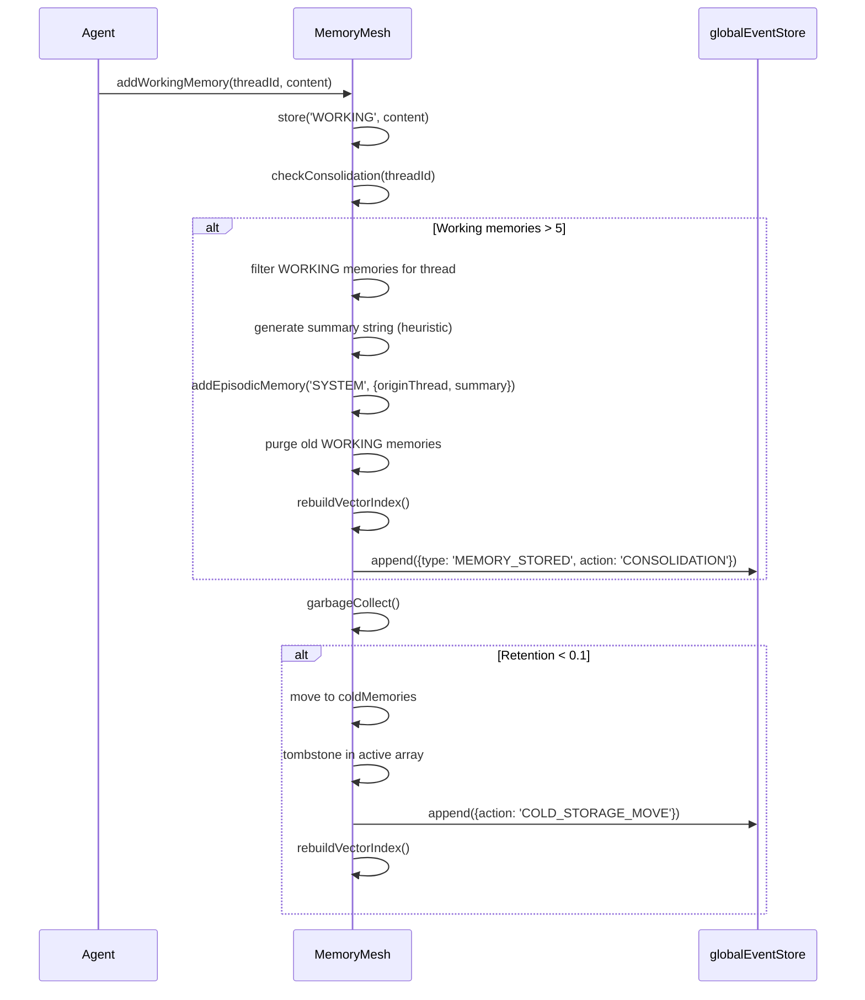

# 🧠 Memory Mesh: 4-Tier Cognitive Persistence

Implemented in `memory/MemoryMesh.ts`, the **Memory Mesh** provides the persistent cognitive architecture for the framework. It utilizes a multi-tier approach to storage, retrieval, and consolidation, combining local vector search (TF-IDF) with structured GraphRAG.



## The Four Tiers of Memory

### Tier 1: Working Memory (Thread Execution)
- **File**: `memory/MemoryMesh.ts` -> `addWorkingMemory`
- **Scope**: Volatile, thread-specific context.
- **Consolidation**: When a thread exceeds **5 events**, the `checkConsolidation` method triggers. It generates a simple summary string (no longer uses `SummarizerAgent`), moves the compressed episode to **Episodic Memory**, and purges the active working set.
- **Safety**: Individual entries are truncated at **20,000 characters** to prevent context overflow.

### Tier 2: Episodic Memory (Experience Stream)
- **File**: `memory/MemoryMesh.ts` -> `addEpisodicMemory`
- **Role**: Stores historical event sequences and summaries of past threads.
- **Utility**: Allows agents to reference previous logic paths and outcomes without re-processing raw logs.

### Tier 3: Semantic Memory (Vectorized & Graph RAG)
- **Implementation**: Uses a local **TF-IDF Vector Index** (via the `natural` library) for keyword-based similarity.
- **GraphRAG**: Implements a Knowledge Graph via `addGraphTriplets`. Agents perform sub-graph retrieval using `retrieveGraphContext`, which traverses directed edges to a specified `maxDepth`.
- **Search**: `searchSimilarMemories` combines TF-IDF scores with a **Temporal Decay Function**. Freshness is prioritized using a retention score: 
  $$retention = e^{-daysSinceAccess / accessCount}$$
- **Isolation**: Strictly filters results by `tenantId` to prevent cross-tenant data leakage.

### Tier 4: Procedural Memory (Wisdom Base)
- **Scope**: Learned instructions, skills, and SOPs.
- **Deduplication**: Uses `natural.DiceCoefficient` to compare new rules against existing ones. If similarity exceeds **0.8**, the system increments the `accessCount` (importance) of the existing rule rather than creating a duplicate.

---

## 🤖 Specialized Components

### Summarizer Agent
- **File**: `memory/SummarizerAgent.ts`
- **Role**: A specialized utility agent (`Context Compressor`) using `gemini-2.5-flash`.
- **Logic**: Specifically tuned to extract key decisions, entities, and unresolved tasks from conversational history while discarding filler.
- **Integration**: Extends `BaseAgent` from `agents/BaseAgent.ts`, uses `ProviderRegistry.generate` from `llm/ProviderRegistry.ts` for LLM calls. Accepts a `MemoryMesh` instance (defaults to `globalMemoryMesh`).
- **Note**: The `SummarizerAgent` is available for external use but is **no longer called internally** by `checkConsolidation`. Consolidation now uses a simple heuristic summary string.

### MemGPT-Style Core Memory
Agents maintain explicit, persistent blocks via `getCoreMemory`:
- **`persona`**: Self-identity and behavioral directives.
- **`human`**: User-specific context and preferences.
- **Constraints**: Each block is capped at **10,000 characters**. Updates are logged to the `globalEventStore` with the `MEMORY_STORED` event type.

---

## 🛠️ Maintenance & Performance

### Garbage Collection & Cold Storage
The `garbageCollect` method runs after storage operations to manage the `SEMANTIC` tier.
- **Tombstoning**: Memories with a **Retention Score < 0.1** are moved to `coldMemories` and replaced with a null tombstone in the active array.
- **Index Rebuild**: Moving memories to cold storage or consolidating working memory triggers `rebuildVectorIndex`, which re-initializes the `natural.TfIdf` instance to maintain index alignment.

### Search Caching
To reduce TF-IDF overhead, `searchSimilarMemories` implements a `searchCache` (Map).
- **Capacity**: Limits to **100 entries** using a "first-in-deleted" pruning strategy.
- **Invalidation**: The cache is cleared automatically whenever `rebuildVectorIndex` is called.

### Event Integration
All major memory operations (Consolidation, Cold Storage moves, Core Memory updates) append events to the `globalEventStore`. This provides a full audit trail of the agent's cognitive state changes.

---

## Class Diagram: MemoryMesh

```mermaid
classDiagram
    class MemoryMesh {
        -memories: VectorMemoryEntry[]
        -tfidf: TfIdf
        -searchCache: Map<string, VectorMemoryEntry[]>
        -coldMemories: VectorMemoryEntry[]
        -graphEdges: Array<{source, target, relation, weight, tenantId}>
        -graphNodes: Map<string, {label, properties, tenantId}>
        -coreMemories: Map<string, CoreMemoryState>
        
        +getCoreMemory(contextId: string): CoreMemoryState
        +updateCoreMemory(contextId: string, block, content, append)
        +addWorkingMemory(threadId, agentId, content, tenantId)
        +addEpisodicMemory(agentId, eventSequence, tenantId)
        +addSemanticMemory(fact, entities, tenantId)
        +addProceduralMemory(rule, skill, tenantId, importance)
        +searchSimilarMemories(query, topK, tenantId): VectorMemoryEntry[]
        +garbageCollect()
        +addGraphTriplets(triplets, tenantId)
        +retrieveGraphContext(startNodes, maxDepth, tenantId): string
        +retrieveContext(tier, queryMetadata): MemoryEntry[]
        -store(tier, content, metadata, vectorize, tenantId)
        -checkConsolidation(threadId)
        -rebuildVectorIndex()
    }

    class SummarizerAgent {
        +constructor(memory: MemoryMesh)
        +execute(history, threadId): Promise<string>
    }

    class VectorMemoryEntry {
        +id: string
        +tier: MemoryTier
        +content: any
        +timestamp: number
        +metadata: Record<string, any>
        +tenantId?: string
        +accessCount?: number
        +lastAccessed?: number
    }

    MemoryMesh --> VectorMemoryEntry : manages
    SummarizerAgent --> MemoryMesh : uses
    SummarizerAgent --> ProviderRegistry : generates LLM responses
```

## Sequence Diagram: Memory Consolidation Flow



## Key Implementation Details

### VectorMemoryEntry Interface
Defined internally in `memory/MemoryMesh.ts`, extends `MemoryEntry` with optional `embedding`, `accessCount`, and `lastAccessed` fields for tracking memory usage and decay. The `embedding` field is retained for backward compatibility but is **no longer actively used** — TF-IDF replaces vector embeddings.

### Global Singleton
Both `globalMemoryMesh` and `globalSummarizer` are exported as singleton instances from their respective modules, ensuring a single shared memory state across the framework.

### Tenant Isolation
All memory operations accept an optional `tenantId` parameter. The `searchSimilarMemories` method enforces multi-tenant isolation by filtering results before scoring, preventing cross-tenant data leakage.

### Consolidation Behavior
The `checkConsolidation` method now uses a **hardcoded heuristic summary** (`"Compressed episode of X events. Core theme: Sub-task progression."`) instead of invoking the `SummarizerAgent`. This reduces latency and LLM costs for routine working memory compression. The `SummarizerAgent` remains available for explicit, high-fidelity summarization tasks when called externally.