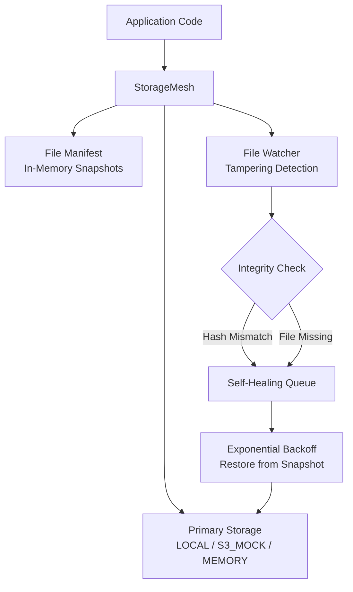
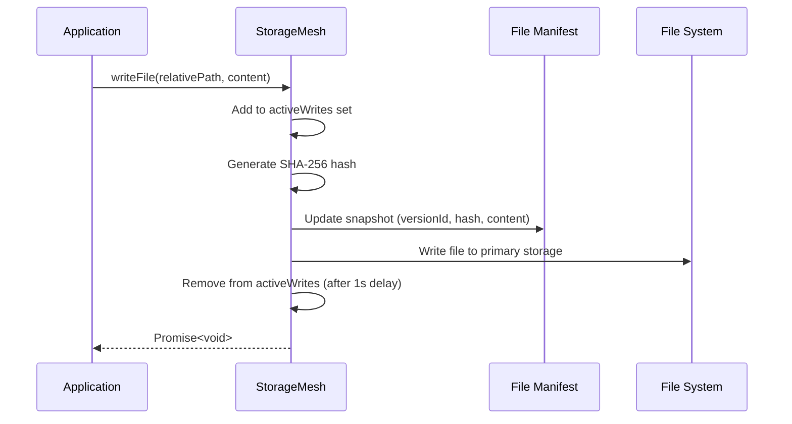
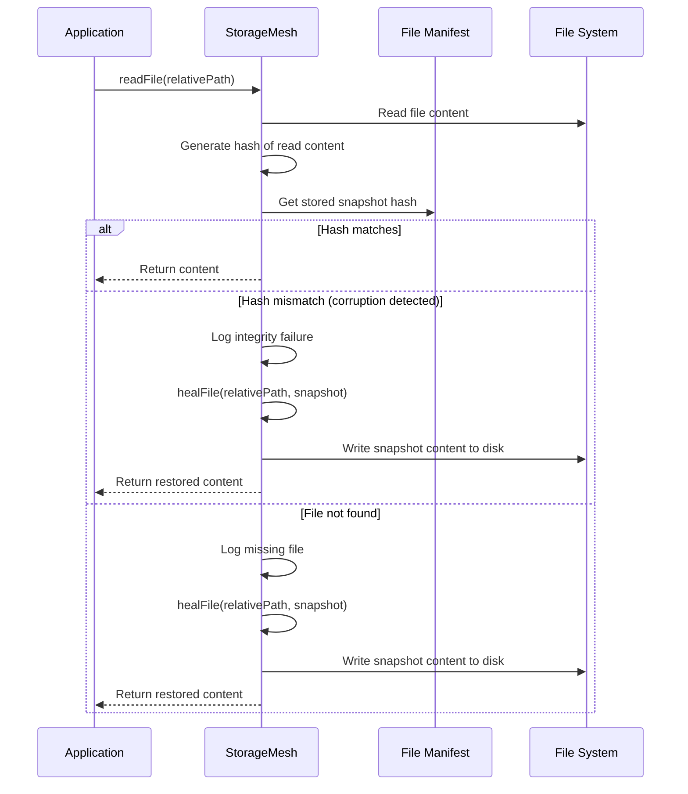
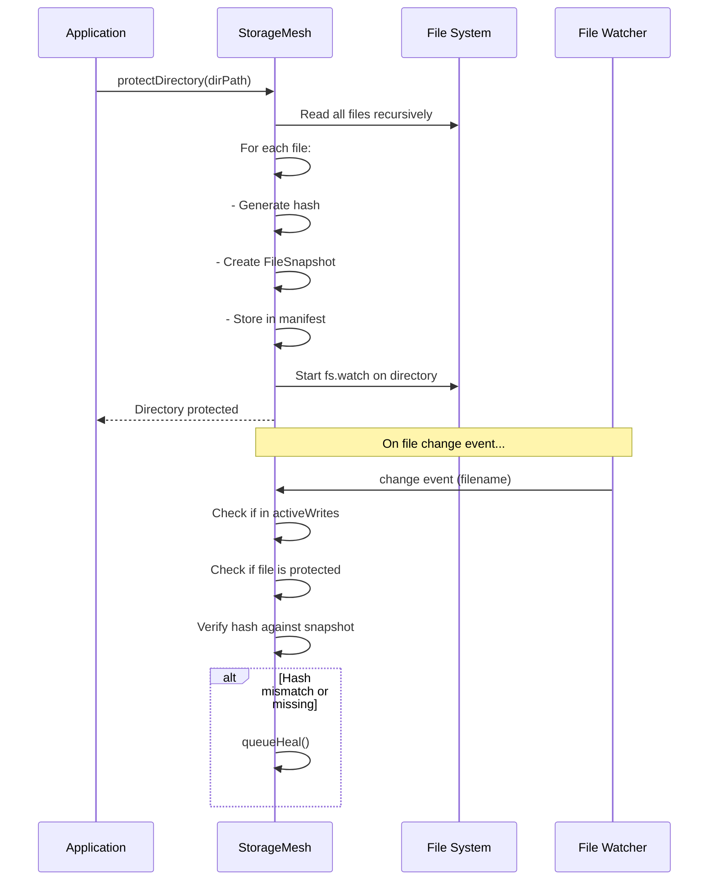

# 🛡️ Resilience & Recovery: StorageMesh

The `storage` component provides a self-healing Virtual File System (VFS) through `StorageMesh`. It ensures 100% availability through redundant backups, integrity checks, and automatic recovery from tampering or corruption.

## 1. StorageMesh: Architecture & Core Concepts
`storage/StorageMesh.ts`

`StorageMesh` wraps file operations with a resilient layer that maintains golden snapshots, detects unauthorized modifications, and automatically heals corrupted or missing files.

### Core Architecture



### Key Components

| Component | Description |
| :--- | :--- |
| `FileSnapshot` | Immutable record of file state: versionId, hash, content, timestamp, protection flag |
| `File Manifest` | In-memory `Map<string, FileSnapshot>` tracking all protected files |
| `File Watcher` | OS-level `fs.watch` monitoring for unauthorized changes |
| `Self-Healing Queue` | Exponential backoff mechanism for automatic recovery |

## 2. FileSnapshot Interface

```typescript
export interface FileSnapshot {
    versionId: string;      // UUID for version tracking
    hash: string;           // SHA-256 hash of content
    content: Buffer | string; // Full file content (backup)
    timestamp: number;      // When snapshot was created
    isProtected: boolean;   // Whether file is under protection
}
```

## 3. StorageMesh API Surface

### Constructor

```typescript
constructor(baseDir: string = './orchestra_workspace', options: StorageOptions = {})
```

| Parameter | Default | Description |
| :--- | :--- | :--- |
| `baseDir` | `'./orchestra_workspace'` | Root directory for all file operations |
| `options.autoBackup` | `undefined` | Enable automatic backup (future use) |
| `options.storageStrategy` | `'LOCAL'` | Storage backend: `LOCAL`, `S3_MOCK`, or `MEMORY` |
| `options.ignorePatterns` | See below | Regex patterns for files to ignore |

**Default ignore patterns:**
```typescript
[/node_modules/, /\.git/, /\.DS_Store/, /dist/, /build/, /\.temp$/, /\.log$/]
```

### Methods

| Method | Description |
| :--- | :--- |
| `protectDirectory(dirPath)` | Initialize protection for a directory (index + watch) |
| `writeFile(relativePath, content)` | Authorized write with snapshot backup |
| `readFile(relativePath)` | Read with automatic integrity check and self-healing |
| `appendFile(relativePath, content)` | Append content with snapshot update |
| `runIntegrityCheck()` | Force full workspace integrity scan |

## 4. File Operations Flow

### Authorized Write Flow



### Read with Integrity Check



## 5. Self-Healing Mechanism

### Healing Queue with Exponential Backoff

```typescript
private queueHeal(relativePath: string, safePath: string, snapshot: FileSnapshot) {
    const count = this.activeHeals.get(relativePath) || 0;
    if (count >= 5) {
        console.error(`CRITICAL: Maximum heal attempts reached for ${relativePath}`);
        return;
    }
    
    const backoffMs = Math.min(1000 * Math.pow(2, count), 30000);
    // 1s, 2s, 4s, 8s, 16s, max 30s
}
```

| Attempt | Backoff Delay |
| :--- | :--- |
| 1 | 1,000ms |
| 2 | 2,000ms |
| 3 | 4,000ms |
| 4 | 8,000ms |
| 5 | 16,000ms |
| 6+ | 30,000ms (capped) |

### Healing Triggers

| Trigger | Detection Method | Action |
| :--- | :--- | :--- |
| File tampered | Hash mismatch via watcher | Queue heal with backoff |
| File deleted | `fs.existsSync` returns false | Queue heal with backoff |
| File locked | `EBUSY` or `EPERM` error | Queue heal with backoff |
| Integrity failure | Hash mismatch on read | Immediate heal (no queue) |
| Missing file | `ENOENT` on read | Immediate heal (no queue) |

## 6. Directory Protection

### protectDirectory Flow



## 7. Path Security

### Directory Traversal Prevention

```typescript
private getSafePath(relativePath: string): string {
    const safePath = path.resolve(this.baseDir, relativePath);
    if (!safePath.startsWith(this.baseDir)) {
        throw new Error(`Path traversal detected: ${relativePath}`);
    }
    return safePath;
}
```

All file operations are validated against directory traversal attacks. Any path resolving outside `baseDir` throws an error.

## 8. Global Instance

```typescript
export const globalStorageMesh = new StorageMesh('./orchestra_workspace');
```

A pre-configured singleton is exported for framework-wide use. It automatically protects the workspace directory on startup.

## 9. Usage Examples

### Basic File Operations

```typescript
import { globalStorageMesh } from './storage/StorageMesh.ts';

// Write a file with automatic backup
await globalStorageMesh.writeFile('config.json', JSON.stringify({ key: 'value' }));

// Read with integrity check
const content = await globalStorageMesh.readFile('config.json');

// Append content
await globalStorageMesh.appendFile('logs.txt', 'New log entry\n');
```

### Directory Protection

```typescript
// Protect framework source code
const storage = new StorageMesh('./src/framework');
await storage.protectDirectory('.');

// Any unauthorized modification will trigger self-healing
```

### Integrity Check

```typescript
const results = await globalStorageMesh.runIntegrityCheck();
console.log(`Healed: ${results.healed.length}`);
console.log(`Missing: ${results.missing.length}`);
console.log(`Corrupted: ${results.corrupted.length}`);
```

## 10. Storage Strategies

| Strategy | Behavior | Use Case |
| :--- | :--- | :--- |
| `LOCAL` | Reads/writes to actual filesystem | Production, development |
| `MEMORY` | All operations in memory | Testing, ephemeral environments |
| `S3_MOCK` | Simulates S3 storage | Testing cloud integration |

## 11. Constraints & Edge Cases

- **Maximum heal attempts:** 5 per file; after that, logs critical error and stops
- **Backoff cap:** 30 seconds maximum delay between heal attempts
- **Active writes window:** 1 second grace period after write to prevent false tampering detection
- **File locking:** `EBUSY`/`EPERM` errors during healing are caught and logged
- **Memory usage:** Full file content stored in manifest; large files consume significant memory
- **Watcher limits:** OS-level `fs.watch` may have platform-specific limitations on recursive watching
- **Startup protection:** Framework source protection is delayed by 100ms to allow initialization